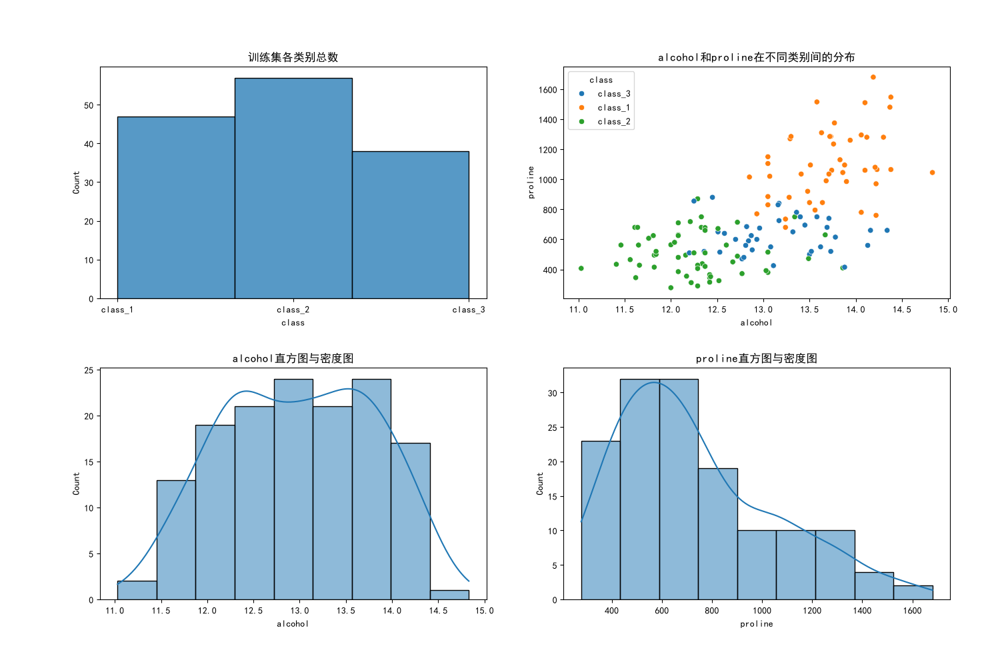
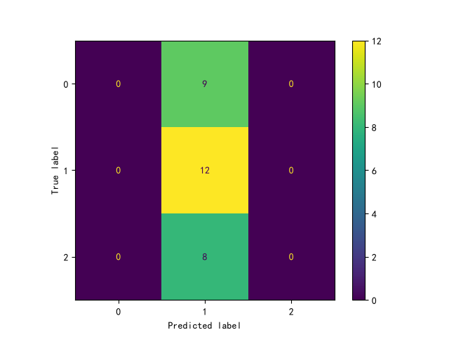
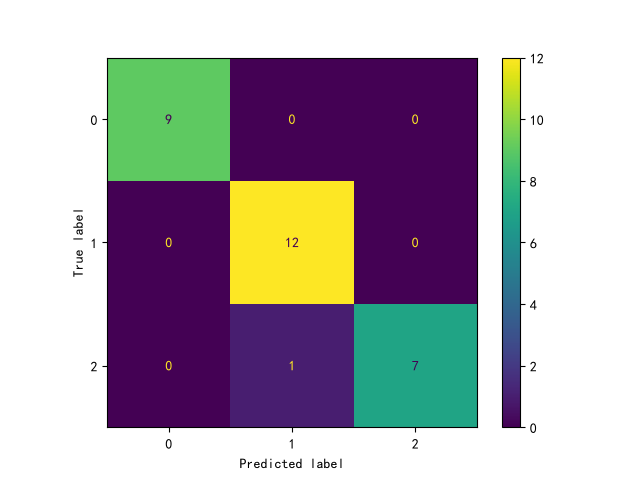

# ML Foundation

一个记录机器学习基础学习过程的 Python 项目，内容涵盖 NumPy 数组运算与梯度下降、Pandas 数据探索、训练集划分、分类基线模型和 Seaborn/Matplotlib 可视化。

## 学习进度（2026-10-05）

### Wine 数据集探索

`scr/train.py` 当前会：

- 加载 scikit-learn 内置 Wine 数据集，并检查字段类型和缺失值；
- 将三个数字目标映射为 `class_1`、`class_2`、`class_3`；
- 使用 `stratify=Y` 和随机种子 `2026`，按 8:2 分层划分开发数据和最终测试数据，并断言两者索引没有重叠；
- 将 142 条开发数据再次按 8:2 分层划分为 113 条拟合数据和 29 条验证数据；最终测试集保留 36 条数据；
- 仅使用训练集绘制类别数量、`alcohol` 与 `proline` 分类散点图，以及两个特征的直方图和核密度图，避免测试集信息泄漏；
- 将图表保存至 `reports/wine数据集探索/wine数据集探索.png`。

脚本已拆分为 `load_data()`、`split_data()`、`plot_eda()` 和 `main()`，只有直接运行文件时才会执行完整流程。初步观察：三个类别数量较均衡；`proline` 呈偏态分布；类别之间存在重叠，但 `alcohol` 与 `proline` 仍表现出一定区分度。

### Wine 分类基线

`scr/baseline.py` 复用 Wine 数据加载与划分逻辑，并在 113 条拟合数据上训练、在 29 条验证数据上比较：

- 使用 `strategy="most_frequent"` 的 `DummyClassifier` 作为最低基线；
- 使用 `StandardScaler` 和 `LogisticRegression(max_iter=1000)` 组成流水线（Pipeline），确保标准化只在拟合数据上学习；
- 计算准确率（Accuracy）、宏平均 F1（Macro F1）和混淆矩阵；
- 将汇总指标写入 `reports/baseline/metrics.csv`，逐条验证预测写入 `reports/baseline/validation_predictions.csv`；
- 将两个模型的混淆矩阵保存为 `reports/baseline/cm_dum.png` 和 `reports/baseline/cm_log.png`。

当前验证结果如下（固定随机种子下）：

| 模型 | 验证样本数 | Accuracy | Macro F1 |
| --- | ---: | ---: | ---: |
| Dummy | 29 | 0.4138 | 0.1951 |
| Logistic Regression | 29 | 0.9655 | 0.9644 |

以上仅为验证集结果；36 条最终测试数据尚未参与模型选择或最终评估。

### Boston Housing 数据探索

`exercises/exercises.py` 当前会：

- 输出 506 条观测、14 个字段的数据总览和描述性统计；
- 统计每列缺失值数量与占比，以及包含缺失值的行数；
- 使用 `value_counts(dropna=False)` 统计 `ZN`，保留缺失值计数；
- 筛选 `RM > 6` 的观测，并按 `CHAS` 分组计算 `MEDV` 均值；
- 统计并绘制 `ZN` 的直方图与核密度图；
- 将图表保存至 `reports/exercises/ZN频数统计.png`。

脚本已拆分为 `load_data()`、`na_count()`、`plot_data()` 和 `main()`。CSV 中的 `NA` 会被 Pandas 自动解析为缺失值。目前共有 112 行包含缺失值；`CRIM`、`ZN`、`INDUS`、`CHAS`、`AGE` 和 `LSTAT` 各缺失 20 个值（约 3.953%）。

### NumPy 数组练习

`exercises/数组练习.py` 使用矩阵乘法计算线性预测 `x @ w + b`，再计算预测值与真实值之间的均方误差（Mean Squared Error, MSE）。脚本还会：

- 检查数组形状，并通过 `axis=0` 和 `axis=1` 分别计算列均值和行均值；
- 对比元素乘法 `x * w` 与矩阵乘法 `x @ w`；
- 对比一维数组与列向量参与运算时的广播结果；
- 从零初始化权重和偏置，手动计算 MSE 梯度并完成一步梯度下降。

关键输出为：

```text
y_hat: [ 8 18 28] MSE: 2.0

x: (3, 2)
y: (3,)
w: (2,)
y_hat: (3,)
err: (3,)

x_mean_axis=0: [2. 3.]
x_mean_axis=1: [0.5 2.5 4.5]

更新前MSE： 382.0
权重梯度： [ -98.66666667 -133.33333333]
偏置梯度： -34.666666666666664
更新后参数： [0.98666667 1.33333333] 0.3466666666666666
更新后MSE： 149.1488
```

> 当前项目已实现单步梯度下降和验证集基线比较，但尚未进行最终测试集评估，也未配置自动化测试。

## 可视化结果

### Wine 数据集



### Boston Housing 的 ZN 分布


### Wine 分类基线混淆矩阵

| DummyClassifier | Logistic Regression |
| --- | --- |
|  |  |

## 项目结构

```text
ml-foundation/
├── data/
│   └── Boston Housing Data.csv
├── exercises/
│   ├── exercises.py
│   └── 数组练习.py
├── reports/
│   ├── baseline/
│   │   ├── cm_dum.png
│   │   ├── cm_log.png
│   │   ├── metrics.csv
│   │   └── validation_predictions.csv
│   ├── exercises/
│   │   └── ZN频数统计.png
│   └── wine数据集探索/
│       └── wine数据集探索.png
├── scr/
│   ├── baseline.py
│   └── train.py
├── environment.yml
└── README.md
```

代码目录名称当前为 `scr`，运行时请勿写成常见的 `src`。

## 环境准备

项目使用 Python 3.13，主要依赖如下：

- NumPy
- Pandas
- scikit-learn
- Matplotlib
- Seaborn

Conda 环境名称为 `MACHINELEARING`（保留项目当前拼写）。如果本机尚未创建该环境，可安装运行现有脚本所需的最小依赖：

```powershell
conda create -n MACHINELEARING -c conda-forge python=3.13 numpy pandas scikit-learn matplotlib seaborn
conda activate MACHINELEARING
```

完整依赖快照见 `environment.yml`。该文件使用 UTF-16 LE 编码，并包含 Windows 平台构建号和本机 `prefix` 路径；部分 Conda 版本无法直接读取，不建议将其作为跨机器安装文件。

## 运行

脚本会自动创建所需的输出目录。激活环境后，在仓库根目录顺序运行全部练习：

```powershell
conda activate MACHINELEARING
python scr/train.py
python scr/baseline.py
python exercises/exercises.py
python "exercises/数组练习.py"
```

也可以不激活环境，使用以下已验证命令：

```powershell
$env:PYTHONIOENCODING = 'utf-8'
$env:MPLBACKEND = 'Agg'
conda run --no-capture-output -n MACHINELEARING python scr/train.py
conda run --no-capture-output -n MACHINELEARING python scr/baseline.py
conda run --no-capture-output -n MACHINELEARING python exercises/exercises.py
conda run --no-capture-output -n MACHINELEARING python "exercises/数组练习.py"
```

- `PYTHONIOENCODING=utf-8` 和 `--no-capture-output` 用于避免 Conda 捕获中文输出时出现编码错误。
- `MPLBACKEND=Agg` 让绘图脚本在无图形界面的环境中直接保存图片。
- 建议顺序执行命令，避免 Windows 下并发调用 Conda 时发生临时文件冲突。
