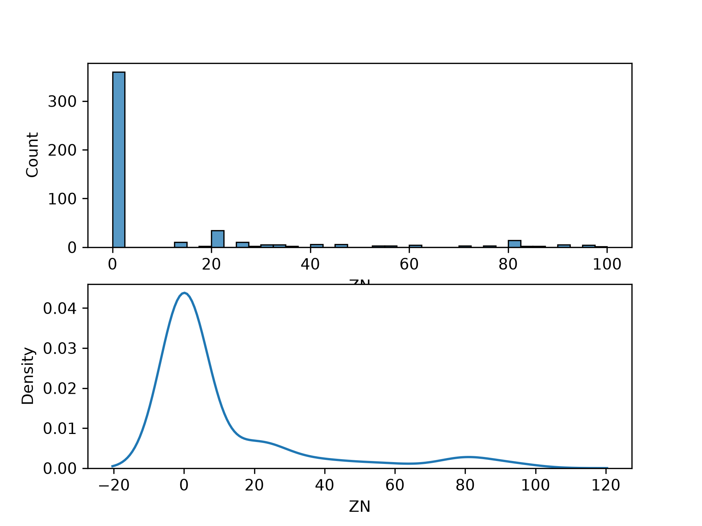

# ML Foundation

一个记录机器学习基础学习过程的 Python 项目，内容涵盖 NumPy 数组运算、Pandas 数据探索、训练集划分和 Seaborn/Matplotlib 可视化。

## 学习进度（2026-10-04）

### Wine 数据集探索

`scr/train.py` 当前会：

- 加载 scikit-learn 内置 Wine 数据集，并检查字段类型和缺失值；
- 将三个数字目标映射为 `class_1`、`class_2`、`class_3`；
- 使用 `stratify=Y` 按 8:2 分层划分训练集和测试集，并断言两者索引没有重叠；
- 绘制训练集类别数量、`alcohol` 与 `proline` 分类散点图，以及两个特征的直方图和核密度图；
- 将图表保存至 `reports/wine数据集探索/wine数据集探索.png`。

初步观察：三个类别数量较均衡；`proline` 呈偏态分布；类别之间存在重叠，但 `alcohol` 与 `proline` 仍表现出一定区分度。

### Boston Housing 数据探索

`exercises/exercises.py` 当前会：

- 输出 506 条观测、14 个字段的数据总览和描述性统计；
- 统计每列缺失值数量与占比，以及包含缺失值的行数；
- 筛选 `RM > 6` 的观测，并按 `CHAS` 分组计算 `MEDV` 均值；
- 统计并绘制 `ZN` 的直方图与核密度图；
- 将图表保存至 `reports/ZN频数统计.png`。

CSV 中的 `NA` 会被 Pandas 自动解析为缺失值。目前共有 112 行包含缺失值；`CRIM`、`ZN`、`INDUS`、`CHAS`、`AGE` 和 `LSTAT` 各缺失 20 个值。

### NumPy 数组练习

`exercises/数组练习.py` 使用矩阵乘法计算线性预测 `x @ w + b`，再计算预测值与真实值之间的均方误差（Mean Squared Error, MSE）。当前示例输出为：

```text
[ 8 18 28] 2.0
```

> 当前项目尚未实现参数训练、完整模型评估流程或自动化测试。

## 可视化结果

### Wine 数据集


### Boston Housing 的 ZN 分布



## 项目结构

```text
ml-foundation/
├── data/
│   └── Boston Housing Data.csv
├── exercises/
│   ├── exercises.py
│   └── 数组练习.py
├── reports/
│   ├── wine数据集探索/
│   │   └── wine数据集探索.png
│   └── ZN频数统计.png
├── scr/
│   └── train.py
├── environment.yml
└── README.md
```

代码目录名称当前为 `scr`，运行时请勿写成常见的 `src`。

## 环境准备

项目使用 Python 3.13，主要依赖如下：

- NumPy
- Pandas
- scikit-learn
- Matplotlib
- Seaborn

Conda 环境名称为 `MACHINELEARING`（保留项目当前拼写）。如果本机尚未创建该环境，可安装运行现有脚本所需的最小依赖：

```powershell
conda create -n MACHINELEARING -c conda-forge python=3.13 numpy pandas scikit-learn matplotlib seaborn
conda activate MACHINELEARING
```

完整依赖快照见 `environment.yml`。该文件使用 UTF-16 LE 编码，并包含 Windows 平台构建号和本机 `prefix` 路径；部分 Conda 版本无法直接读取，不建议将其作为跨机器安装文件。

## 运行

绘图脚本目前不会自动创建输出目录。首次运行前，在仓库根目录执行：

```powershell
New-Item -ItemType Directory -Force -Path reports, "reports/wine数据集探索" | Out-Null
```

激活环境后可顺序运行全部练习：

```powershell
conda activate MACHINELEARING
python scr/train.py
python exercises/exercises.py
python "exercises/数组练习.py"
```

也可以不激活环境，使用以下已验证命令：

```powershell
$env:PYTHONIOENCODING = 'utf-8'
$env:MPLBACKEND = 'Agg'
conda run --no-capture-output -n MACHINELEARING python scr/train.py
conda run --no-capture-output -n MACHINELEARING python exercises/exercises.py
conda run --no-capture-output -n MACHINELEARING python "exercises/数组练习.py"
```

- `PYTHONIOENCODING=utf-8` 和 `--no-capture-output` 用于避免 Conda 捕获中文输出时出现编码错误。
- `MPLBACKEND=Agg` 让绘图脚本在无图形界面的环境中直接保存图片。
- 建议顺序执行命令，避免 Windows 下并发调用 Conda 时发生临时文件冲突。
